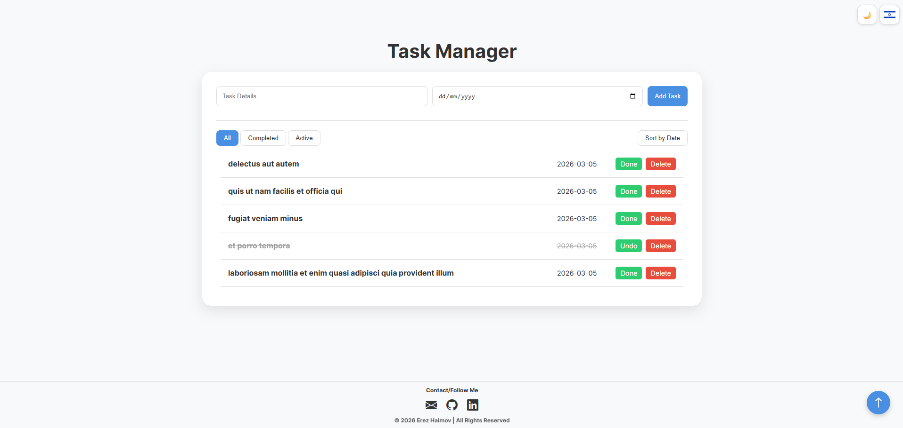

# Erez Haimov - Task Manager Project

This Task Manager project demonstrates a **Full-Stack approach** to application development.
Beyond front-end design, it involves **API integration** to fetch and map external data, complex **state management** for CRUD operations, and persistent data storage using **LocalStorage**.
It highlights my ability to build a fully functional application that bridges the gap between raw data and a responsive, user-centric interface.

## Useful navigation

- [Overview](#overview)
	- [The challenge](#the-challenge)
	- [Screenshot](#screenshot)
	- [Links](#links)
- [My process](#my-process)
	- [Technologies](#technologies)
	- [Ongoing Development](#ongoing-development)
	- [Useful resources](#useful-resources)
- [Author](#author)

## Overview

### The challenge

- **Full-Stack Logic:** Implement CRUD (Create, Read, Update, Delete) functionality with persistent storage to ensure data survives page refreshes.
- **API Integration:** Fetch initial data from external REST APIs and map it into the application's internal data structure.
- **Dynamic UI:** Develop a theme switcher (Dark/Light mode) and a multi-language toggle (English/Hebrew) that persist across sessions.
- **Data Organization:** Implement sorting algorithms (by Date) and filtering logic (All/Active/Completed) to manage task lists efficiently.
- **Responsive Grid Design:** Utilize CSS Grid for a structured, column-based layout that remains fluid across mobile and desktop devices.
- **Accessibility:** Ensure the application is keyboard-navigable, uses semantic HTML, and provides sufficient color contrast in both themes.

### Screenshot

### Links

- Live Site URL: [https://erezhaimov.github.io/Erez-Haimov-Task-Manager/](https://erezhaimov.github.io/Erez-Haimov-Task-Manager/)

## My process

### Technologies

- **Semantic HTML5** – For clear document structure and improved SEO/Accessibility.
- **Modern CSS (Grid & Flexbox)** – Used for the multi-column task layout and responsive alignment.
- **CSS Variables & Clamp()** – To maintain a dynamic, scalable design system and seamless theme switching.
- **Vanilla JavaScript (ES6+)** – For core application logic, asynchronous API calls (Fetch), and DOM manipulation.
- **LocalStorage API** – For client-side data persistence and preference saving (Theme/Language).

### Ongoing Development

I am currently focusing on deepening my understanding of **Asynchronous JavaScript** and error handling during API interactions.
Additionally, I plan to explore and build more scalable and complex full-stack applications in the future.

### Useful resources

- [JSONPlaceholder](https://jsonplaceholder.typicode.com/) - Used for fetching initial task data.
- [Bootstrap Icons](https://icons.getbootstrap.com/) - For intuitive UI iconography.
- [FlagCDN](https://flagcdn.com/) - For the language toggle icons.
- [Google Fonts](https://fonts.google.com/) - Specifically the "Inter" font family for modern typography.

## Author

- GitHub - [ErezHaimov](https://github.com/ErezHaimov)
- LinkedIn - [erez-haimov](https://www.linkedin.com/in/erez-haimov/)
